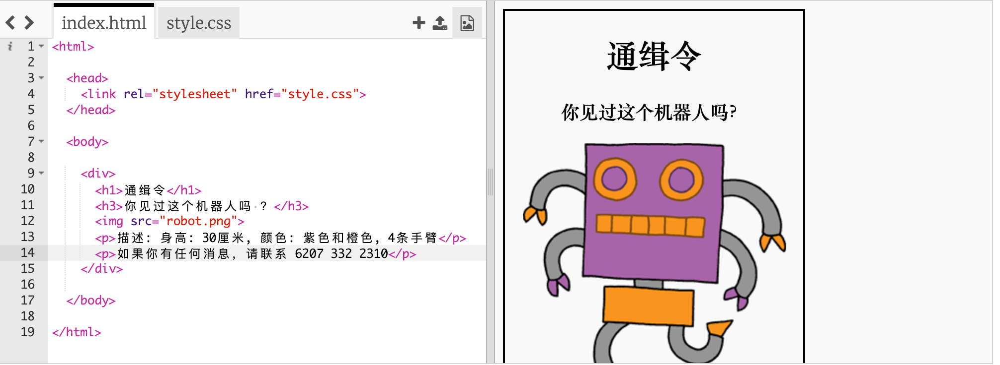
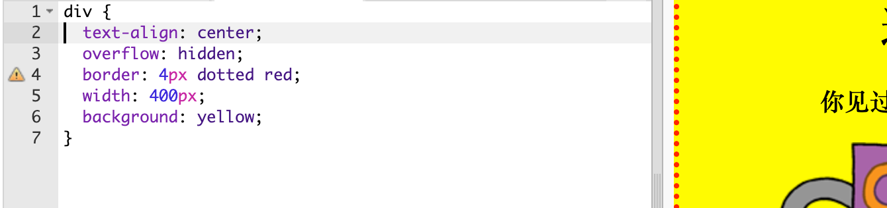

## 设置你的海报样式

首先让我们来编辑海报的 CSS 代码。

+ 打开这个Trinket: <a target="_blank" href="https://trinket.io/html/ebc58e7e26">trinket.io/html/ebc58e7e26</a>。
    
    效果应该是这样：
    
    

+ 点击“style.css”选项卡。你会发现包含海报不同部分的 `div` 已具备 CSS 属性。
```    
        div {
            text-align: center;
            overflow: hidden;
            border: 2px solid black;
            width: 300px;
        }   
```        

+ 首先让我们来更改 `text-align`（文本对齐）属性：
```    
        text-align: center;
```        
    
你将 `center`（居中）更改为 `left`（向左）或 `right`（向右）时会发生什么？

+ ​`border`（边框）属性会怎么样呢？
```    
        border: 2px solid black;
```        
    
上文代码中的 `2px` 指 2 个像素。你将 `2px solid black`（2 个像素宽，黑色，实线）更改为 `4px dotted red`（4 个像素宽，红色，虚线）时会发生什么？

+ 将海报的 `width`（宽度）更改为 `400px`。海报会怎么样？

+ 让我们添加一些 CSS 来设置海报的背景颜色。转向代码的第 5 行末尾并按回车，由此产生一个新的空行。
    

    
在新空行中输入以下代码：
```   
    background: yellow;
```        
    
确保你输入的代码与上文的代码*完全*相同。你会发现 `<div>` 的背景现在变为黄色。
    
