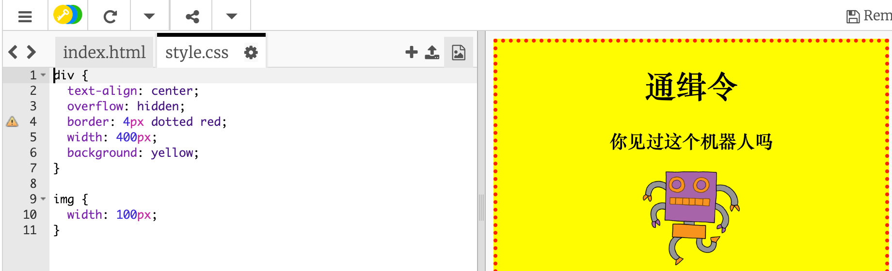

## 设置图片样式

让我们来完善海报中的图片样式。

+ 此时，你的 `` 标记并无任何 CSS 属性，那就让我们来添加一些吧！
    
    首先，在你的 div 的CSS下面添加以下代码：
    
        img {
        
        }
        
    
    

+ 我们现在可以在大括号｛｝之间添加图片的 CSS 属性。
    
    例如，在大括号之间添加以下代码来设置图片宽度：
    
        width: 100px;
        
    
    你会看到图片的尺寸发生了变化，宽度现在是 100 像素。
    
    

+ 你还可以用以下代码在图片周围添加边框：
    
        border: 1px solid black;
        

+ 你有没有注意到图片与边框之间几乎没有空间？
    
    
    
    你可以通过在图片周围添加一些 padding（内边距）来解决这个问题：
    
        padding: 10px;
        
    
    Padding（内边距）是内容（在这里为一张图片）与其边框之间的空间。
    
    
    
    如果你将内边距更改为 `50px`，你认为会发生什么？