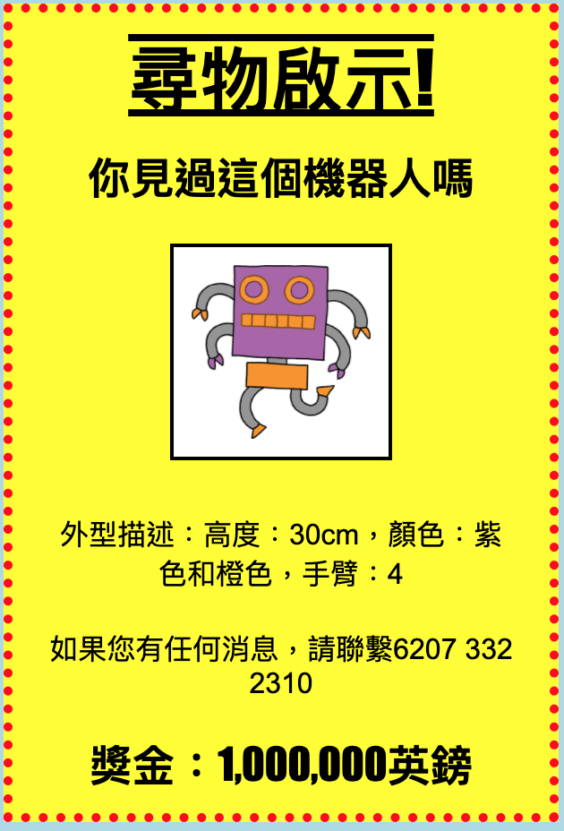

## 介紹

你將在本專案中學習如何製作你自己的海報。

### 給教師的其他信息

如果您需要列印此項目，請使用 [列印版本](https://projects.raspberrypi.org/zh-TW/projects/wanted/print)。

--- collapse ---
---
title: 給教師的話 
---

## 介紹：

孩子們將有機會在本專案中編寫自己的 CSS。他們還將編寫 CSS 屬性和選擇器來製作自己的海報。

## 線上資源

我們建議使用 [trinket](https://trinket.io/) 在\線上編寫HTML & CSS。該項目包含以下 trinket：

* ['通緝'的起點 - trinket.io/html/69860bb73b](https://trinket.io/html/69860bb73b)

孩子們也可以利用這個空白trinket [jumpto.cc/html-blank](http://jumpto.cc/html-blank) 來編寫自己的HTML & CSS，或者他們可以使用這個模板trinket [jumpto.cc/html-template](http://jumpto.cc/html-template)。

還有一個 trinket，其中包含挑戰的樣本解決方案：

* ['尋物啟示'完成 - trinket.io/html/7eace1b7e8](https://trinket.io/html/7eace1b7e8)

## 離線資源

這個專案也可以 [離線完成](https://rpf.io/html-offline)。你可以通過單擊此專案的“專案資源”連結來訪問專案資源。 此連結包含一個“專案資源”部分，其中包括孩子們離線完成本專案時所需的資源。 確保每個孩子都能使用這些資源的副本。 本節包括以下檔案：

* template/index.html
* template/style.css
* wanted/index.html
* wanted/style.css
* wanted/robot.png

你還可以在「志工相關資源」部分中找到內含挑戰的專案完整版，包括以下文件：

* wanted-finished/index.html
* wanted-finished/style.css
* wanted-finished/robot.png

（以上所有的資源也可以作為專案和志願者.zip 檔案下載。）

## 學習目標

* 本專案讓孩子們有機會編寫自己的 CSS 來設定網頁樣式。

該專案涵蓋了 [Raspberry Pi數位創造課程](http://rpf.io/curriculum)的以下幾個元素：

* [設計基本的2D和3D資源](https://www.raspberrypi.org/curriculum/design/creator)。

## 挑戰

* “改進你的海報” - 為 `div` 選擇器添加新的CSS屬性;
* “改善圖像” - 向 `img` 選擇器添加新的CSS屬性;
* “使你的海報引人注目” - 添加新的CSS屬性和新的 `h3` 和 `p` 選擇器;
* “宣傳一場活動” - 編寫和編輯HTML和CSS代碼。

--- /collapse ---

--- collapse ---
---
title: 專案材料
---

## 專案資源

* [包含所有項目資源的.zip文件](https://rpf.io/p/zh-TW/wanted-go)
* [線上 Trinket 包含所有'尋物啟示！'項目資源](https://trinket.io/html/69860bb73b)
* [線上 Trinket 模板](http://jumpto.cc/trinket-template)
* [線上空白 Trinket](http://jumpto.cc/trinket-blank)
* [模板/ index.html](resources/template-index.html)
* [模板/ style.css文件](resources/template-style.css)
* [尋物啟示/ index.html](resources/wanted-index.html)
* [希望/ style.css文件](resources/wanted-style.css)
* [希望/ robot.png](resources/wanted-robot.png)

## 教師資源

* [包含所有已完成項目資源的.zip文件](https://rpf.io/p/zh-TW/wanted-go)
* [線上已完成的Trinket專案](https://trinket.io/html/7eace1b7e8)
* [尋物啟示成品/ index.html](resources/wanted-finished-index.html)
* [尋物啟示成品/ style.css文件](resources/wanted-finished-style.css)
* [尋物啟示成品/ robot.png](resources/twanted-finished-robot.png)

--- /collapse ---