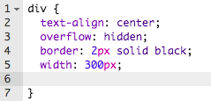

## 設定你的海報樣式

首先讓我們來編輯海報的 CSS 代碼。

+ 打開這個 trinket： <a target="_blank" href="https://trinket.io/html/69860bb73b">trinket.io/html/69860bb73b</a>。
    
    此專案應如下所示：
    
    

+ 點選“style.css”分頁標籤。你會發現包含海報不同部分的 div 已具備 CSS 屬性。
    
        div {
            text-align: center;
            overflow: hidden;
            border: 2px solid black;
            width: 300px;
        }   
        

+ 首先讓我們來更改 `text-align`（文字對齊）屬性：
    
        text-align：center;
        
    
    你將 `center`（置中）更改為 `left`（靠左）或 `right`（靠右）時會發生什麼？

+ 更改 border（邊框）屬性會怎麼樣呢？
    
        border: 2px solid black;
        
    
    上文代碼中的`2px` 指邊框粗細為 2 個像素。你將 `2px solid black`（2 個像素黑色實線）更改為 `4px dotted red`（4 個像素紅色虛線）時會發生什麼？

+ 將海報的 `width` 更改為 `400px`。海報會怎麼樣？

+ 讓我們新增一些 CSS 來設定海報的背景顏色。轉向代碼的第 5 行末尾並按 Enter，由此產生一個新的空行。
    
    
    
    在新空行中輸入以下代碼：
    
        background: yellow;
        
    
    確保您在上面輸入的代碼 *一模一樣* 。您會發現 `
` 的背景現在是黃色的。
    
    