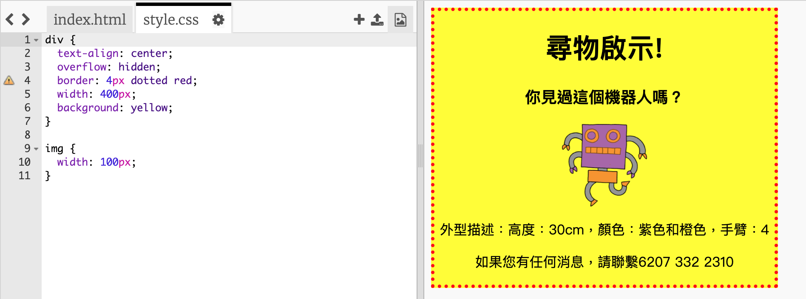

## 設定圖片樣式

讓我們來完善海報中的圖片樣式。

+ 此時，你的 `` 標記並無任何 CSS 屬性，那就讓我們來新增一些！
    
    首先，在 CSS 的下方向你的 div 新增以下代碼：
    
        img {
        
        }
        
    
    

+ 我們現在可以在大括號之間新增圖片的CSS屬性。
    
    例如，在大括號之間新增以下代碼來設定圖片寬度：
    
        width: 100px;
        
    
    你會看到圖片的尺寸改變，寬度變為 100 像素。
    
    

+ 你還可以用以下代碼在圖片周圍新增邊框：
    
        border: 1px solid black;
        

+ 您是否注意到圖像與邊框之間沒有太大空間？
    
    
    
    你可以通過在圖片周圍新增一些內邊距來解決這個問題：
    
        padding: 10px;
        
    
    內邊距是內容（在這裡為一張圖片）與其邊框之間的空間。
    
    
    
    如果將內邊距更改為 `50px`您認為會發生什麼？