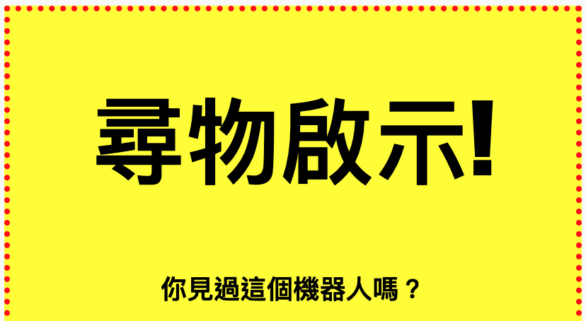
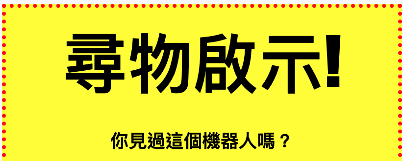

## 造型標題

讓我們改進 `<h1>` 標題的風格。

+ 在圖像的CSS下面添加以下代碼：
    
        h1 {
        
        }
        
    
    您可以在此處為主 `<h1>` 標題添加CSS屬性。

+ 要更改 `<h1>` 標題的字體，請在大括號之間添加以下代碼：
    
        font-family：影響;
        

+ 您還可以更改標題的大小：
    
        font-size：50pt;
        

+ 你有沒有註意到 `<h1>` 標題和它周圍的東西之間有一個很大的空間？
    
    
    
    這是因為標題周圍有一個邊距。邊距是元素（在本例中為標題）與其周圍的其他內容之間的空間。
    
    您可以使用以下代碼縮小邊距：
    
        保證金：10px;
        
    
    

+ 您還可以在標題下劃線：
    
        文字裝飾：下劃線;