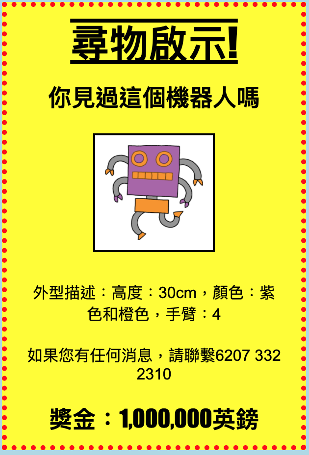

\---挑戰\---

## 挑戰：讓你的海報真棒！

添加更多CSS代碼來設置您的 `<h3>` 標題和段落的樣式。

以下是您可以使用的一些CSS屬性的列表：

    顏色：黑色;
    背景：白色;
    字體系列：Arial / Comic Sans MS / Courier / Impact / Tahoma;
    字體大小：12pt;
    字體重量：粗體;
    文字裝飾：下劃線過線;
    保證金：10px;
    填充：10px;
    寬度：100px;
    高：100px;
    

\--- /挑戰\---